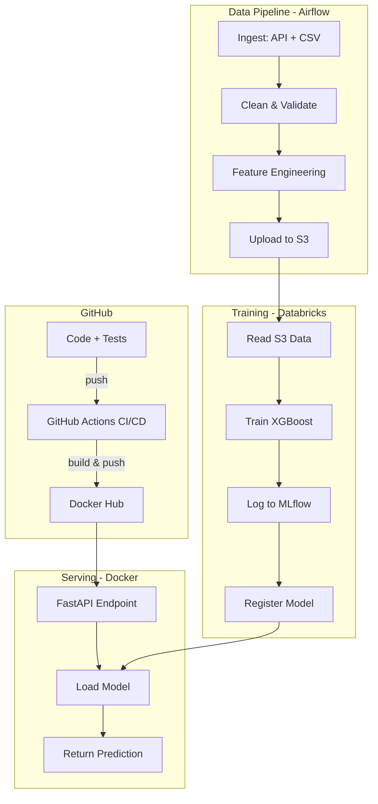

# 📈 Crypto & Stock Price Volatility Forecasting

## Project Overview

**What it does:** Predicts 24-hour price trend & volatility for Bitcoin (BTC) and major stocks (e.g., S&P 500 ETF) so you can optimize automated trading signals or portfolio rebalancing during high-volatility periods.

**Why it matters to you daily:** You receive automated daily risk alerts and target price range predictions directly via API/dashboard, helping you make informed buy/sell decisions.

**Tech stack summary:**

| Layer               | Tool                                                   |
| ------------------- | ------------------------------------------------------ |
| Orchestration       | Apache Airflow                                         |
| Compute / Training  | Databricks (Community Edition — free)                 |
| Model               | XGBoost (regression/classification)                    |
| Experiment Tracking | MLflow (built into Databricks)                         |
| Serving             | FastAPI in Docker                                      |
| CI/CD               | GitHub Actions                                         |
| Containerization    | Docker + Docker Compose                                |
| Data Sources        | Binance REST API, Yahoo Finance (`yfinance`), AWS S3 |
| Monitoring          | Evidently AI (data drift)                              |

---

## Architecture Diagram



---

## Directory Structure

```
energy-forecast/
├── .github/
│   └── workflows/
│       ├── ci.yml                  # lint + test on every PR
│       └── cd.yml                  # build & push Docker image on merge to main
├── airflow/
│   ├── dags/
│   │   └── energy_pipeline_dag.py  # main DAG: ingest → clean → feature → upload
│   ├── plugins/
│   │   └── hooks/
│   │       └── openmeteo_hook.py   # custom Airflow hook for weather API
│   └── docker-compose.airflow.yml  # local Airflow with Docker Compose
├── databricks/
│   ├── notebooks/
│   │   ├── 01_explore.py           # EDA notebook
│   │   ├── 02_train.py             # XGBoost training + MLflow logging
│   │   └── 03_evaluate.py          # model comparison & promotion
│   └── jobs/
│       └── train_job.json          # Databricks job definition (JSON)
├── src/
│   ├── data/
│   │   ├── ingest.py               # fetch weather API + read smart meter CSV
│   │   ├── clean.py                # handle nulls, outliers, type casting
│   │   └── validate.py             # Great Expectations or simple checks
│   ├── features/
│   │   └── build_features.py       # lag features, rolling stats, time encoding
│   ├── model/
│   │   ├── train.py                # XGBoost training logic
│   │   ├── predict.py              # load model → predict
│   │   └── evaluate.py             # RMSE, MAE, MAPE
│   └── serving/
│       ├── app.py                  # FastAPI application
│       └── schemas.py              # Pydantic request/response models
├── tests/
│   ├── test_ingest.py
│   ├── test_features.py
│   ├── test_model.py
│   └── test_api.py
├── monitoring/
│   └── drift_report.py            # Evidently AI data/model drift
├── docker/
│   ├── Dockerfile                 # serving container
│   └── docker-compose.yml         # full local stack
├── configs/
│   ├── model_config.yaml          # hyperparameters
│   └── pipeline_config.yaml       # paths, API keys, schedule
├── .pre-commit-config.yaml
├── pyproject.toml
├── Makefile                       # shortcuts: make train, make serve, etc.
└── README.md
```

---

## Phase 1 — Environment Setup

### 1.1 Create the repository

1. Go to GitHub → **New repository** → name it `energy-forecast`
2. Add a `.gitignore` (Python template) and MIT license
3. Clone locally:
   ```bash
   git clone https://github.com/<your-username>/energy-forecast.git
   cd energy-forecast
   ```

### 1.2 Python environment

Use `pyproject.toml` for dependency management (modern standard).

**Key dependencies:**

| Group    | Packages                                             |
| -------- | ---------------------------------------------------- |
| Core     | `xgboost`, `pandas`, `numpy`, `scikit-learn` |
| Pipeline | `apache-airflow`, `boto3` (S3), `requests`     |
| Serving  | `fastapi`, `uvicorn`, `pydantic`               |
| MLOps    | `mlflow`, `evidently`                            |
| Dev      | `pytest`, `ruff`, `pre-commit`, `black`      |

**Steps:**

1. Create virtual environment: `python -m venv .venv && source .venv/bin/activate`
2. Install in editable mode: `pip install -e ".[dev]"`

### 1.3 Pre-commit hooks

Your `.pre-commit-config.yaml` should have:

- **ruff** — fast linter (replaces flake8 + isort)
- **black** — code formatter
- **mypy** — type checking (optional but impressive)

Install hooks: `pre-commit install`

> [!TIP]
> Run `pre-commit run --all-files` before your first commit to fix everything at once.

---

## Phase 2 — Data Ingestion

### 2.1 Data sources

| Source                       | What                                                 | How                          |
| ---------------------------- | ---------------------------------------------------- | ---------------------------- |
| **Binance Public API** | Hourly Crypto OHLCV (Open, High, Low, Close, Volume) | Free REST API, no key needed |
| **Yahoo Finance API**  | Hourly/Daily stock index data (e.g., SPY, QQQ)       | `yfinance` Python package  |

### 2.2 Crypto API ingestion

**Endpoint:** `https://api.binance.com/api/v3/klines`

**Key parameters:**

- `symbol` — `BTCUSDT`
- `interval` — `1h`
- `limit` — `1000`

**Instructions:**

1. In `src/data/ingest.py`, write `fetch_crypto_data(symbol, interval, limit)` to get OHLCV data.
2. Write `fetch_stock_data(ticker, period, interval)` using `yfinance`.
3. Save raw outputs to `data/raw/crypto_{date}.parquet` and `data/raw/stocks_{date}.parquet`.

---

## Phase 3 — Data Pipeline with Apache Airflow

### 3.1 DAG design

DAG `market_pipeline_dag` runs **hourly** or **daily**:

```
fetch_crypto_data ──┐
                    ├──▶ clean_and_validate ──▶ build_features ──▶ upload_to_s3
fetch_stock_data ───┘
```

---

## Phase 4 — Feature Engineering

### 4.1 Features to build

In `src/features/build_features.py`:

| Feature                         | Description                           |
| ------------------------------- | ------------------------------------- |
| `rsi_14`                      | Relative Strength Index (momentum)    |
| `macd` & `macd_signal`      | Moving Average Convergence Divergence |
| `bollinger_hband` / `lband` | Volatility spread bands               |
| `return_lag_1h`, `24h`      | Price % change in past 1h & 24h       |
| `volatility_24h`              | 24-hour rolling standard deviation    |
| `volume_rolling_mean_24h`     | 24-hour average trading volume        |

### 4.2 Merging crypto + stock market data

1. Merge Crypto & Stock features on `datetime` with `pd.merge_asof()` (handles market close/time mismatches)
2. Drop first 24 rows (NaN from lag features)
3. Save to `data/features/features_{date}.parquet`

---

## Phase 5 — Model Training on Databricks

### 5.1 Databricks setup

1. Sign up for [Databricks Community Edition](https://community.cloud.databricks.com/) — free
2. Create smallest cluster
3. Install `xgboost`: **Libraries → PyPI → `xgboost`**
4. Connect S3: use `dbutils.fs.mount()` with your AWS keys

### 5.2 Training notebook (`02_train.py`)

**Step by step:**

1. **Read data** from S3 → Spark DataFrame → convert to Pandas
2. **Time-based split** (not random!):
   - Train: everything before last 7 days
   - Validation: last 7 days minus final day
   - Test: final day
3. **XGBoost initial hyperparameters:**
   ```yaml
   objective: reg:squarederror
   n_estimators: 500
   max_depth: 6
   learning_rate: 0.05
   subsample: 0.8
   colsample_bytree: 0.8
   early_stopping_rounds: 50
   ```
4. **MLflow autologging:**
   ```python
   # Hint: mlflow.xgboost.autolog()
   # Then fit the model — MLflow logs everything automatically
   ```
5. **Log extra metrics** manually: RMSE, MAE, MAPE on test set
6. **Log feature importance** as artifact (PNG plot)
7. **Register model** in MLflow Registry:
   - Name: `energy-forecast-xgboost`
   - Stage: `Staging` → after validation → `Production`

### 5.3 Hyperparameter tuning

**Option A — Optuna (recommended):**

- Create Optuna study in a Databricks notebook
- Search space: `max_depth` (3–10), `learning_rate` (0.01–0.3), `n_estimators` (100–1000)
- Objective: minimize validation RMSE
- Log each trial to MLflow

**Option B — Databricks AutoML:**

- Use `databricks.automl.regress()` as baseline, then beat it manually

> [!TIP]
> Interview line: "I used Optuna for hyperparameter search with MLflow logging so every trial is traceable and reproducible."

---

## Phase 6 — Model Serving with FastAPI + Docker

### 6.1 FastAPI app (`src/serving/app.py`)

| Method   | Path            | Description                           |
| -------- | --------------- | ------------------------------------- |
| `GET`  | `/health`     | Returns`{"status": "healthy"}`      |
| `POST` | `/predict`    | Accepts features JSON → 24h forecast |
| `GET`  | `/model-info` | Model version, training date, metrics |

**Instructions:**

1. On startup, load XGBoost model from `.json` file (exported from MLflow)
2. Define Pydantic schemas for request/response
3. `/predict` receives: `temperature`, `humidity`, `cloud_cover`, `hour`, `day_of_week`, etc.
4. Returns: `{"predictions": [0.42, 0.38, ...], "unit": "kWh"}`

### 6.2 Dockerfile (`docker/Dockerfile`)

1. Base: `python:3.11-slim`
2. Copy only required files (`src/serving/`, model, requirements)
3. Expose port 8000
4. CMD: `uvicorn src.serving.app:app --host 0.0.0.0 --port 8000`

**Build & run:**

```bash
docker build -t energy-forecast-api -f docker/Dockerfile .
docker run -p 8000:8000 energy-forecast-api
```

### 6.3 Docker Compose (`docker/docker-compose.yml`)

Services to include:

- `api` — FastAPI serving container
- `minio` — local S3 storage (optional)
- `airflow` — reference to airflow compose (optional)

---

## Phase 7 — CI/CD with GitHub Actions

### 7.1 CI Pipeline (`.github/workflows/ci.yml`)

**Triggers:** every push and pull request

**Steps:**

1. Checkout code
2. Setup Python 3.11
3. Install: `pip install -e ".[dev]"`
4. Lint: `ruff check .`
5. Format: `black --check .`
6. Test: `pytest tests/ -v`
7. (Optional) Build Docker image to verify

**Skeleton:**

```yaml
name: CI
on: [push, pull_request]
jobs:
  test:
    runs-on: ubuntu-latest
    steps:
      - uses: actions/checkout@v4
      - uses: actions/setup-python@v5
        with:
          python-version: "3.11"
      - run: pip install -e ".[dev]"
      - run: ruff check .
      - run: black --check .
      - run: pytest tests/ -v
```

### 7.2 CD Pipeline (`.github/workflows/cd.yml`)

**Triggers:** merge to `main`

**Steps:**

1. Build Docker image
2. Push to Docker Hub (or GitHub Container Registry)
3. (Optional) Trigger Databricks retraining via API

**GitHub Secrets needed:**

- `DOCKERHUB_USERNAME`, `DOCKERHUB_TOKEN`
- `AWS_ACCESS_KEY_ID`, `AWS_SECRET_ACCESS_KEY`

> [!WARNING]
> Never hardcode secrets. Always use `${{ secrets.MY_SECRET }}`.

---

## Phase 8 — Monitoring & Drift Detection

### 8.1 Data drift with Evidently AI

In `monitoring/drift_report.py`:

1. Load reference (training data) and current (last 24h) datasets
2. Create `DataDriftPreset` report
3. Save HTML report to `monitoring/reports/`
4. Alert if drift in >30% of features

**Workflow:**

- Run weekly via Airflow (add DAG task)
- If drift detected → log warning → optionally trigger retraining

### 8.2 Model performance monitoring

Track over time:

- **RMSE** on new data vs. training RMSE
- **Prediction distribution** shifts
- **Feature distributions** changes

---

## Phase 9 — Git Workflow

### Branch strategy

```
main ──────────────────────── (production)
  │
  ├── develop ─────────────── (integration)
  │     ├── feature/airflow-dag
  │     ├── feature/xgboost-training
  │     ├── feature/fastapi-serving
  │     └── feature/github-actions
  │
  └── hotfix/fix-api-crash
```

### Commit format — [Conventional Commits](https://www.conventionalcommits.org/)

```
feat: add weather API ingestion
fix: handle missing values in lag features
docs: add training notebook instructions
ci: add pytest to GitHub Actions
```

### PR template (`.github/PULL_REQUEST_TEMPLATE.md`)

```markdown
- [ ] Tests pass locally
- [ ] Linter passes (`ruff check .`)
- [ ] Code formatted (`black .`)
- [ ] Docstrings added for new functions
- [ ] No secrets in code
```

---

## Build Order — Exact Sequence

| Step | Build                                           | Branch                          |
| ---- | ----------------------------------------------- | ------------------------------- |
| 1    | Repo + env + pre-commit + pyproject.toml        | `main` (initial)              |
| 2    | `src/data/ingest.py` + tests                  | `feature/data-ingestion`      |
| 3    | `src/data/clean.py` + `validate.py` + tests | `feature/data-cleaning`       |
| 4    | `src/features/build_features.py` + tests      | `feature/feature-engineering` |
| 5    | Airflow DAG + docker compose                    | `feature/airflow-pipeline`    |
| 6    | S3 upload (or MinIO)                            | `feature/cloud-storage`       |
| 7    | Databricks notebooks (EDA → train → evaluate) | `feature/model-training`      |
| 8    | MLflow logging + model registry                 | `feature/mlflow-tracking`     |
| 9    | FastAPI serving + Dockerfile                    | `feature/model-serving`       |
| 10   | GitHub Actions CI                               | `feature/ci-pipeline`         |
| 11   | GitHub Actions CD                               | `feature/cd-pipeline`         |
| 12   | Evidently monitoring                            | `feature/monitoring`          |
| 13   | README + final polish                           | `feature/documentation`       |

> [!IMPORTANT]
> Do NOT skip to step 7 before steps 2–4 work. Each step needs passing tests and a merged PR before moving on.

---

## Testing Strategy

| File                 | What to test                                                               |
| -------------------- | -------------------------------------------------------------------------- |
| `test_ingest.py`   | Mock API response → verify DataFrame shape and columns                    |
| `test_features.py` | Known input → verify lag/rolling features correct                         |
| `test_model.py`    | Train on tiny data → predictions are floats, no NaN                       |
| `test_api.py`      | `TestClient` → `/health` returns 200, `/predict` returns valid JSON |

Run: `pytest tests/ -v --tb=short`

---

## README Structure

Your `README.md` sections:

1. **Title + badge** — ``
2. **One-line description**
3. **Architecture diagram**
4. **Quick Start** — 5 commands to run full stack
5. **Tech Stack** — table with versions
6. **Project Structure** — directory tree
7. **Data Sources** — with links
8. **Model Performance** — RMSE, MAE table
9. **API Docs** — endpoint table
10. **CI/CD** — explanation
11. **Future Improvements** — 3–4 bullets

---

## Interview Questions This Project Answers

| Question                            | Your answer                                                  |
| ----------------------------------- | ------------------------------------------------------------ |
| "How do you handle data pipelines?" | Airflow DAG with modular tasks                               |
| "How do you track experiments?"     | MLflow autologging on Databricks                             |
| "How do you deploy models?"         | FastAPI in Docker, CI/CD with GitHub Actions                 |
| "How do you monitor models?"        | Evidently AI drift reports                                   |
| "How do you version code?"          | Git branching + conventional commits                         |
| "How do you handle features?"       | Lag variables, rolling stats, cyclical encoding              |
| "Why XGBoost?"                      | Fast, handles tabular data well, built-in feature importance |
| "How do you prevent data leakage?"  | Time-based split, no future data in features                 |
